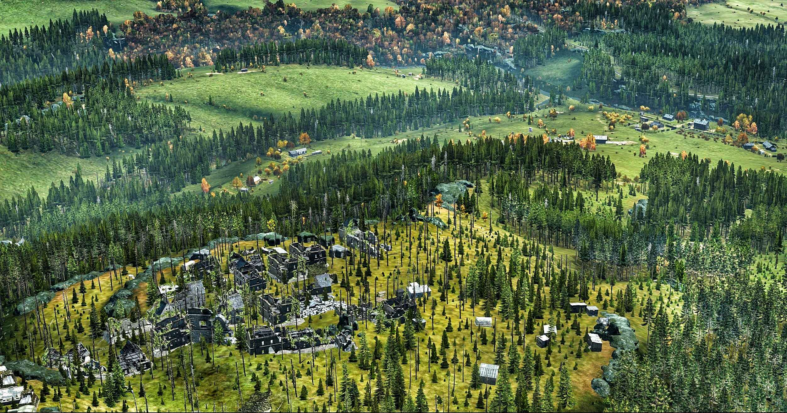
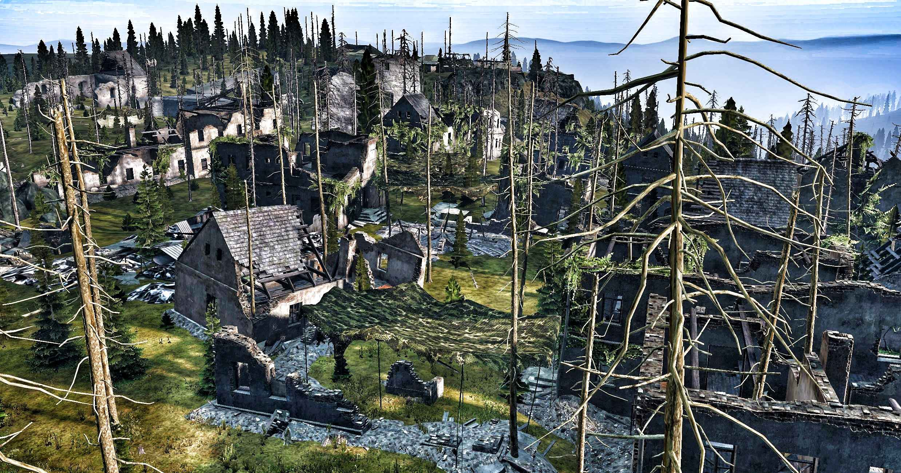
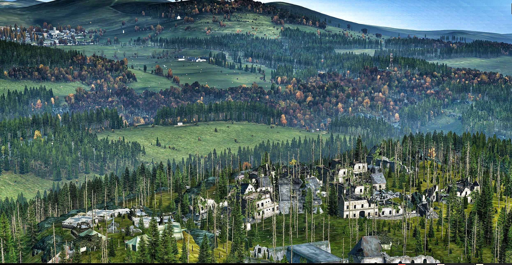
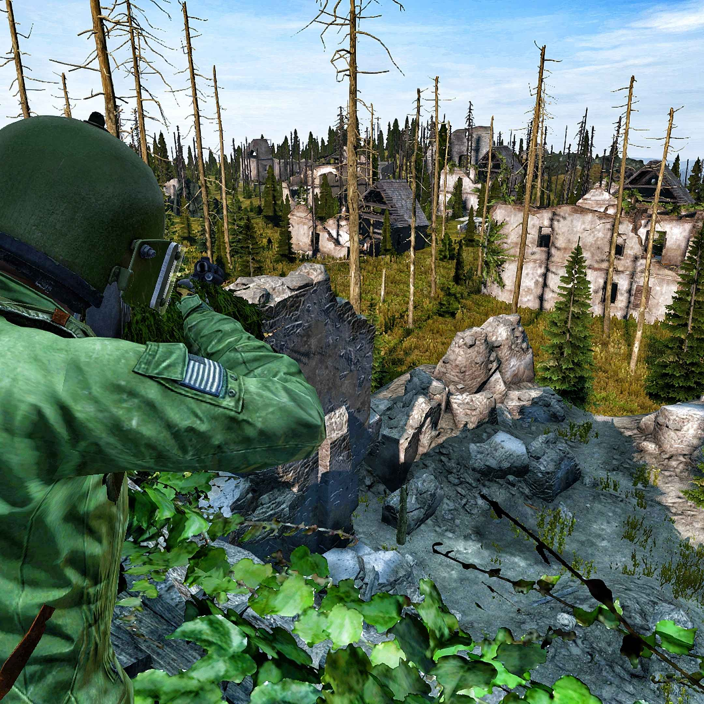

# Creator
[iLLMannerSevs](https://github.com/iLLMannerSevs)
#### DayZ NETWORk*: DayZ Community Networking       https://discord.gg/sUacYXp
#### The Arcade: DayZ Community Support & Help      https://discord.gg/nRZpgXJthw
#### YouTube:        https://www.youtube.com/@illmannersevs
---
### Zvir Summit Military Ruins
Perfect addition to the harsh terrains of Zvir deadlands for PvP event area or for some added touches to the amazing landscape of the far NW of Chernarus.

- *If adding `mapgrouppos.xml` entries, please note that you may want to increase your CLE accordingly.*
- Most of the `ruins` buildings naturally are configured in `mapgrouproto.xml` to spawn in civilian loot items. You can change this in `mapgroupproto.xml` by adjusting the `<usage name="">` to `Military` or what ever you wish.

---
- JSON
    - [Added Objects](zvir_summit.json)
- .XML
    - [mapgrouppos.xml](zvir_summit.xml) - Add these to existing file to incorporate loot spawns to the additional structures.